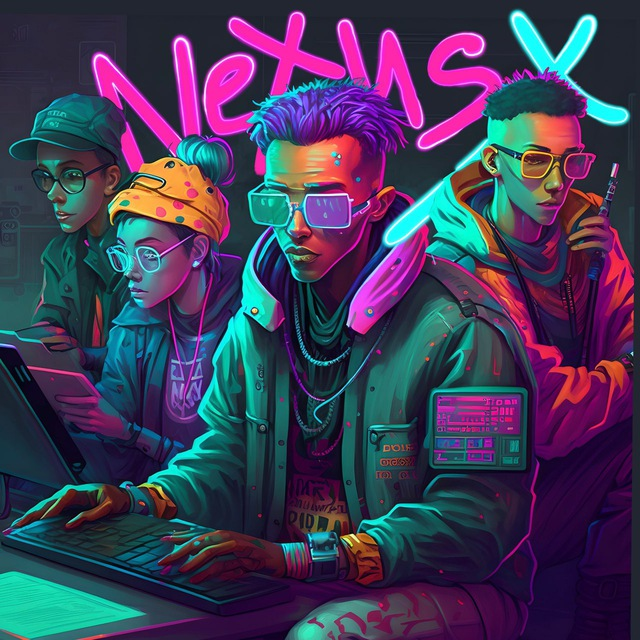

<h1 align="center">
Решение трека №1 от команды NexusX Team | RTL.Hack
</h1>

    

### Участники команды

<ul>
    <li>
        <a href="https://t.me/G_Rosman" style="text-decoration: none; border-radius: 4px; outline: 2px solid blue; color: lightblue; text-align: left; padding: 2px 5px; margin-right: 7px;">
            Яроцкий Глеб
        </a>
        (Backend-разработка)
    </li>
    <li>
        <a href="https://t.me/operculum" style="text-decoration: none; border-radius: 4px; outline: 2px solid blue; color: lightblue; text-align: left; padding: 2px 5px; margin-right: 7px;">
            Поляков Дмитрий
        </a>
        (UI/UX, спикер)
    </li>
    <li>
        <a href="https://t.me/VALI666KO" style="text-decoration: none; border-radius: 4px; outline: 2px solid blue; color: lightblue; text-align: left; padding: 2px 5px; margin-right: 7px;">
            Кофанов Валентин
        </a>
        (Backend-разработка)
    </li>
    <li>
        <a href="https://t.me/kasperrr123" style="text-decoration: none; border-radius: 4px; outline: 2px solid blue; color: lightblue; text-align: left; padding: 2px 5px; margin-right: 7px;">
            Низамидинов Малик
        </a>
        (Backend-разработка)
    </li>
    <li>
        <a href="https://t.me/keyrea_dy" style="text-decoration: none; border-radius: 4px; outline: 2px solid blue; color: lightblue; text-align: left; padding: 2px 5px; margin-right: 7px;">
            Корчак Родион
        </a>
        (Frontend-разработка, капитан команды)
    </li>
</ul>

### Скрипты приложения:

`npm start` - запуск frontend-части приложение на devServer  
`npm run start:dev` - запуск frontend-части и json-server для dev-разработки  
`npm run build:dev` - сборка приложение (development-версия)  
`npm run build:prod` - сборка приложение (production-версия)  
`npm run lint:ts` - запустить линтер для ts-файлов  
`npm run lint:ts:fix` - запустить линтер для ts-файлов и пофиксить все, что возможно  
`npm run lint:scss` - запустить линтер для scss-файлов  
`npm run lint:scss:fix` - запустить линтер для scss-файлов и пофиксить все, что возможно  
